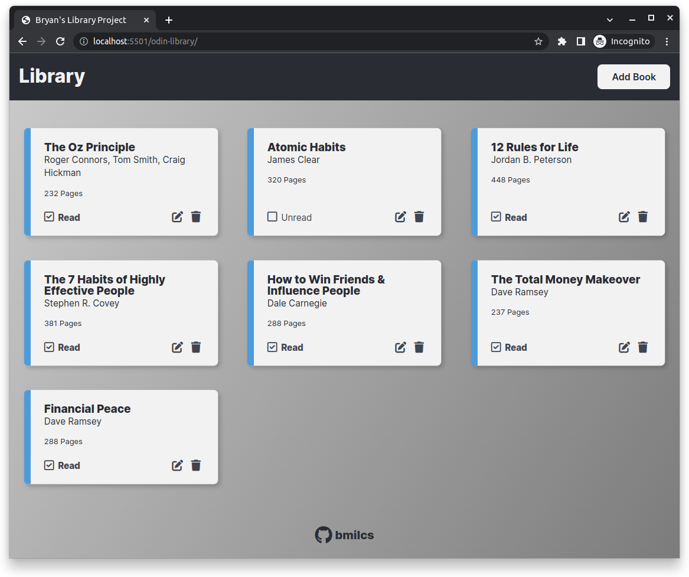
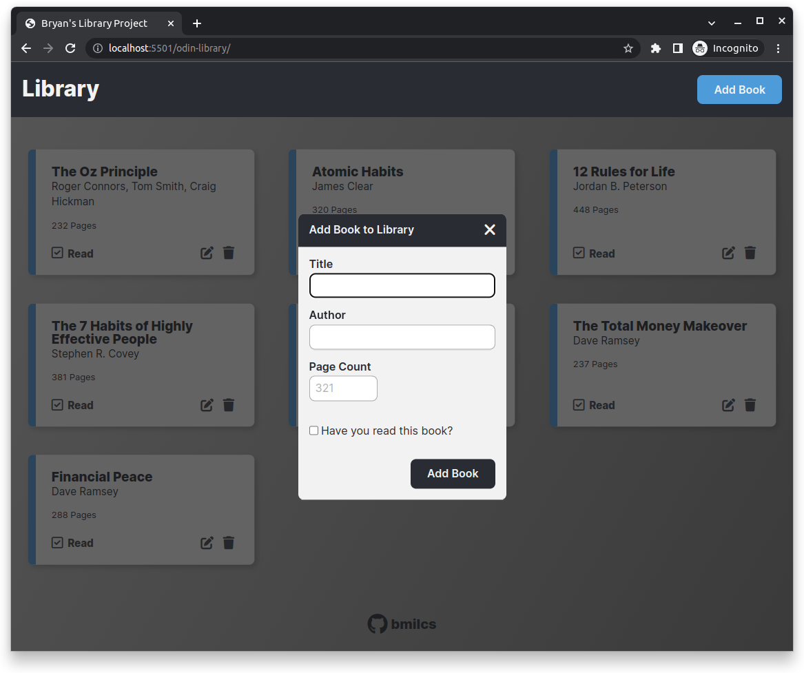

# Odin Project #8: Library

Welcome to Bryan Miller's Library Project, the [eighth assignment](https://www.theodinproject.com/lessons/node-path-javascript-library) within the Odin Project curriculum. The goal of this repo is to practice the following skill sets:

- JavaScript
  - Object & Object Constructor Design Pattern
  - Prototypes
    - Prototype: _a property that all functions have that points to an object_
  - Refactored to use _classes_
- HTML / CSS

## Summary

The `Book` constructor function and methods defined on the its prototype (`.createCard()`, `editBook()` `removeBook()`, `.toggleReadStatus()`, etc.) perform the bulk of the work. Each instance of the `Book` object contains the book information, methods that allow you to manipulate it and the html elements that display on the page.

I covered my UI/UX bases through subtle animations and by adding a variety of input methods:

- Edit books:
  - Icon
  - Double clicking on a card
- Closing the form:
  - Icon
  - ESC key
  - Clicking outside of the form

All in all, this was a great introduction to Object & Object Constructors as a design pattern, the FontAwesome library and the `normalize.css` CSS reset.

Note: Prototypal inheritance & the `Object.create()` method weren't necessary due to the scope of the project.

## Links

- [Live Demo](https://bmilcs.github.io/odin-library/)
- [My Odin Project Progress](https://github.com/bmilcs/odin-project)

## Screenshots





## Deployment

```sh
git clone https://github.com/bmilcs/odin-library
```
